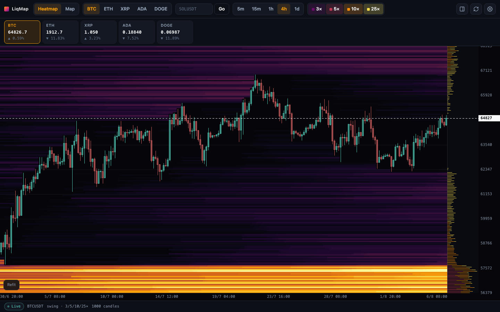
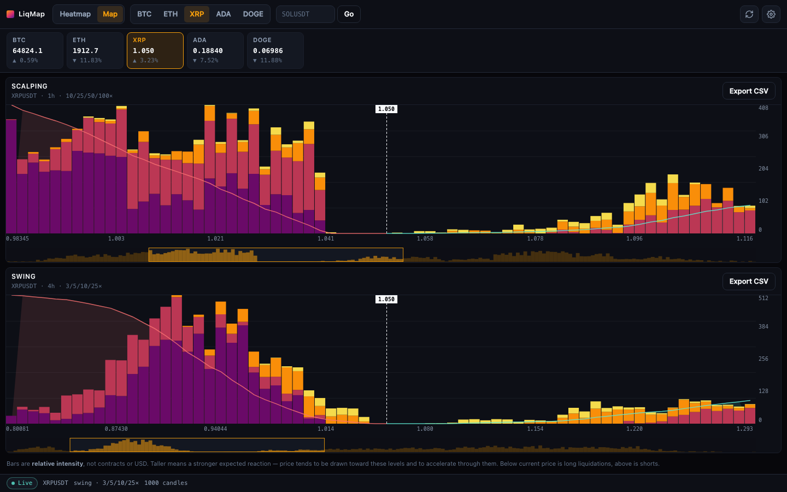
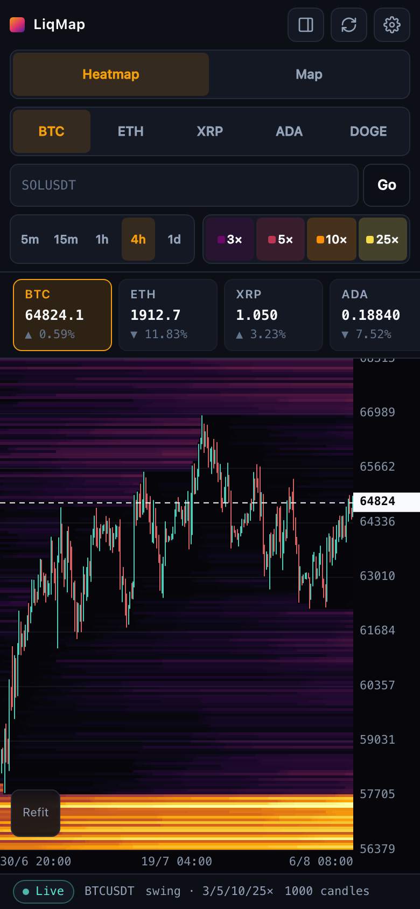

# LiqMap

A crypto liquidation heatmap that runs entirely in your browser. It pulls public Bybit v5
market data, computes where leveraged positions would be liquidated, and paints the result
as a time × price heatmap. No API key, no backend, no account.



## Run it

```bash
npm install
npm run dev       # http://localhost:5177
```

| Command | What it does |
|---|---|
| `npm run dev` | Dev server with HMR |
| `npm test` | Engine + data-layer unit tests (no network) |
| `npm run build` | Typecheck and produce a static `dist/` |
| `npm run preview` | Serve the production build |
| `npm run screenshots` | Recapture `docs/screenshots/` from a running dev server |

## What you are looking at

**Bright horizontal bands are price levels where a lot of leverage would get liquidated.**
Price tends to be drawn toward them, and they often act as acceleration zones rather than
support — when price reaches one, the liquidations there become forced market orders.

**A band that stops dead in the middle of the chart has been consumed.** Every candle
erases the levels inside its own high–low range, because price trading through a level means
those positions are already liquidated. That vertical edge is the moment the level got
swept, and it is the single most informative thing on the chart.

Scores are **relative**, not dollars. They rank levels against each other on the current
screen; they are not exchange-reported position sizes.

## Liquidation Map

The **Map** tab answers a different question from the heatmap. The heatmap is history — how
levels built up and got swept over time. The Map is *now*: how much estimated liquidation
volume is sitting at each price level at this moment, stacked by leverage tier.



It is literally the heatmap's **last column** — the active-levels snapshot after the most
recent candle's clearing pass — reshaped into a price profile. There is no second pipeline.

- **Scalping** (10/25/50/100×, from 1h candles) and **Swing** (3/5/10/25×, from 4h) are
  shown together, because the two leverage regimes sit at very different distances.
- Everything **left of the dashed marker is long liquidations**, everything right is shorts.
- The **cumulative curve** sums outward from current price in each direction: how much total
  liquidation price would pass through to reach a given level.
- **Export CSV** gives `price_from, price_to, L1..L4, cumulative` per mode.

You will usually see a **gap either side of current price**. That is not missing data — the
latest candle cleared its own high–low range, so nothing is pending where price just traded.

The same profile is available as a **side panel** on the heatmap (the panel button in the
toolbar), drawn against the chart's own price axis so each bar sits at exactly the height of
the band it describes. It collapses automatically on narrow screens.

Tier colours mean the same thing everywhere — toolbar chips, Map bars, side panel:
deep purple is the lowest leverage, bright yellow the highest.

## Controls

- **Wheel** zooms time, **shift/ctrl+wheel** zooms price, **drag** pans, **double-click**
  refits. On touch: one finger pans, two fingers pinch.
- **Tier buttons** (3×/5×/10×/25× on swing, 10×/25×/50×/100× on scalping) toggle which
  leverage cohorts are painted. This is render-only — nothing is recomputed.
- **Watchlist** shows each symbol's live price and the distance to its nearest strong band.
- **Settings** holds proximity alerts: notify when a band above a strength threshold comes
  within a chosen percentage of price.

## How it works

```
src/
  engine/     pure, synchronous, no React and no network — all of the maths
    tiers.ts        interval → leverage ladder, liquidation price formulas
    grid.ts         1100-bucket price axis
    oi.ts           open-interest alignment and the ΔOI weight multiplier
    seed.ts         per-candle clear + seed of the live level vector
    build.ts        the walk: clear → seed → snapshot, one column per candle
    normalize.ts    p99.7 percentile → vmax, gamma curve
    bands.ts        column → ranked price levels
    profile.ts      last column → binned, tier-stacked profile + cumulative curves
    profileCsv.ts   profile → CSV
    alerts.ts       relative band scaling, proximity + cooldown logic
    colormap.ts     inferno ramp + the four tier colours
  data/       network only
    rest.ts         kline, open interest (cursor paginated), tickers
    ws.ts           public linear socket, 20s ping, backoff reconnect
    cache.ts        TTL memo shared by the watchlist
  ui/         React
    scale.ts        the one price↔Y transform, shared by chart and side panel
    HeatmapCanvas   heat raster, candles, crosshair, docked profile strip
    ProfileChart    one Map panel: bars, cumulative, brush, tooltip
    MapView         Scalping + Swing panels, CSV export
    …               toolbar, watchlist, settings, hooks
```

### The model

For each closed candle, oldest first:

1. **Clear** every bucket inside `[low, high]`. Price traded there, so those positions are gone.
2. **Seed** the levels the candle implies. Three entry anchors — close `0.45`, high `0.275`,
   low `0.275` — each weighted by
   `min(turnover / medianTurnover, 5) × clamp(1 + 8·max(ΔOI/OI, 0), 1, 3)`
   and split across four tiers as `[0.35, 0.30, 0.20, 0.15]`.
   Long liquidation at `entry·(1 − 1/L)`, short at `entry·(1 + 1/L)`.
3. **Snapshot** the live vector into column `t`.

One `Float32Array` per tier (`nCols × 1100`), so tier toggles never trigger a rebuild.

Rendering uses inferno with `x = (score/vmax)^0.68`, `vmax` = the 99.7th percentile of the
**non-zero** values currently on screen, and `alpha = 35 + 220·min(1, 1.25x)`. The raster is
drawn at native bucket resolution and upscaled with smoothing off, so buckets stay crisp.

### Why Bybit only

Binance rejects browser CORS on its public market endpoints, so a no-backend build cannot
use it. Bybit's v5 public endpoints are CORS-open and need no key. Symbols are Bybit linear
perpetuals; the custom input accepts any of them.

## Tests

```bash
npm test
```

145 tests, none of which touch the network — `fetch` and `WebSocket` are stubbed. The engine
is pure, so it is tested directly against synthetic candles. The load-bearing case is the
clearing invariant: a level seeded at candle 0 must still be present at candle 2 and exactly
zero at the candle whose range covers it.

## PWA and iOS

`vite.config.ts` sets `base: './'` so every asset path is relative, and the service worker
caches **only** the app shell — requests to `api.bybit.com` are network-only and never
cached, because a stale liquidation map is worse than none. The build is static with no SSR
and no Node runtime requirements, so it can be wrapped with Capacitor as-is. Layout already
honours `env(safe-area-inset-*)` and works down to 360px.



## Caveats

- Liquidation levels are **inferred** from price, volume and open interest. Exchanges do not
  publish per-position leverage, so this is a model, not ground truth.
- Levels far from price are never swept, so they accumulate into bright shelves near the
  grid edges. That is the model behaving correctly, but it means band strength is judged
  within ±12% of price (`BAND_WINDOW_PCT`) so those shelves do not drown out everything else.
- Open interest history is short on some symbols; where it is missing the weight multiplier
  falls back to a neutral 1 and the map is turnover-weighted only.
